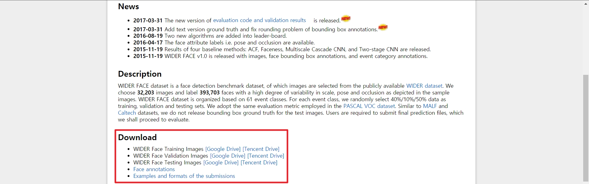

## Data Preparation: WIDER FACE

1. Download [WIDER FACE](http://shuoyang1213.me/WIDERFACE/) to *\${WIDER_FACE_DIR}*

2. Unzip all *.zip* files in *\${WIDER_FACE_DIR}*

   ```
   .
   ├── Submission_example.zip
   ├── wider_face_split.zip
   ├── WIDER_test.zip
   ├── WIDER_train.zip
   └── WIDER_val.zip
   ```

3. Then, you can see the files below from *\${WIDER_FACE_DIR}/wider_face_split*:

   ```
   .
   ├── readme.txt
   ├── wider_face_test_filelist.txt
   ├── wider_face_test.mat
   ├── wider_face_train_bbx_gt.txt
   ├── wider_face_train.mat
   ├── wider_face_val_bbx_gt.txt
   └── wider_face_val.mat
   ```

4. Copy and paste each file to the path given in the table below:

   | Filename                       | Path                                                |
   | ------------------------------ | --------------------------------------------------- |
   | *wider_face_train.mat*         | *\${WIDER_FACE_DIR}/WIDER_train/wider_face_split/*: |
   | *wider_face_train_bbx_gt.txt*  | *\${WIDER_FACE_DIR}/WIDER_train/wider_face_split/*: |
   | *wider_face_val.mat*           | *\${WIDER_FACE_DIR}/WIDER_val/wider_face_split/*:   |
   | *wider_face_val_bbx_gt.txt*    | *\${WIDER_FACE_DIR}/WIDER_val/wider_face_split/*:   |
   | *wider_face_test.mat*          | *\${WIDER_FACE_DIR}/WIDER_test/wider_face_split/*:  |
   | *wider_face_test_filelist.txt* | *\${WIDER_FACE_DIR}/WIDER_test/wider_face_split/*:  |

   * Keep all files in *\${WIDERFACE_DIR}/wider_face_split*