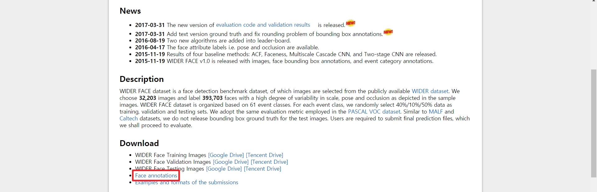

## Issue description

* *demo.py* fails to run with the error below

```
FileNotFoundError: [Errno 2] No such file or directory: '/swook/dataset/wider-face-WIDER_val/wider_face_split/wider_face_val.mat'
```

## Code example

*  Command to reproduce the bug:

```
root@80d507e4db93:/swook/repos/tencent/dsfd# python demo.py --trained_model /swook/model/dsfd/WIDERFace_DSFD_RES152.pth --widerface_root /swook/dataset/wider-face-WIDER_val --save_folder ./save --visual_threshold 0.1 --cuda CUDA
```

* Error messages:

```
FileNotFoundError: [Errno 2] No such file or directory: '/swook/dataset/wider-face-WIDER_val/wider_face_split/wider_face_val.mat'
```

* Whole stack traces:

```
Traceback (most recent call last):
  File "demo.py", line 28, in <module>
    from widerface_val import bbox_vote
  File "/swook/repos/tencent/dsfd/widerface_val.py", line 236, in <module>
    testset = WIDERFaceDetection(args.widerface_root, 'val' , None, WIDERFaceAnnotationTransform())
  File "/swook/repos/tencent/dsfd/data/widerface.py", line 150, in __init__
    self.f = scipy.io.loadmat(osp.join(self.path_to_label, self.fname))
  File "/opt/conda/lib/python3.6/site-packages/scipy/io/matlab/mio.py", line 216, in loadmat
    with _open_file_context(file_name, appendmat) as f:
  File "/opt/conda/lib/python3.6/contextlib.py", line 81, in __enter__
    return next(self.gen)
  File "/opt/conda/lib/python3.6/site-packages/scipy/io/matlab/mio.py", line 19, in _open_file_context
    f, opened = _open_file(file_like, appendmat, mode)
  File "/opt/conda/lib/python3.6/site-packages/scipy/io/matlab/mio.py", line 45, in _open_file
    return open(file_like, mode), True
FileNotFoundError: [Errno 2] No such file or directory: '/swook/dataset/wider-face-WIDER_val/wider_face_split/wider_face_val.mat'
```

## System Info

- PyTorch or Caffe2: PyTorch
- How you installed PyTorch (conda, pip, source): docker ([nvcr.io/nvidia/pytorch](https://ngc.nvidia.com/catalog/containers/nvidia:pytorch))
- Build command you used (if compiling from source): None
- OS: Ubuntu 16.04 LTS
- PyTorch version: 1.4.0
- Python version: 3.6
- CUDA/cuDNN version: 10.2
- GPU models and configuration: 2080 Ti
- GCC version (if compiling from source): None
- CMake version: None
- Versions of any other relevant libraries: None

# Comment 1

1. Download *wider_face_split.zip* from [WIDER FACE: A Face Detection Benchmark](http://shuoyang1213.me/WIDERFACE/) and unzip it

   

2. Then, you can see the files below:

   ```
   .
   ├── readme.txt
   ├── wider_face_test_filelist.txt
   ├── wider_face_test.mat
   ├── wider_face_train_bbx_gt.txt
   ├── wider_face_train.mat
   ├── wider_face_val_bbx_gt.txt
   └── wider_face_val.mat
   ```

3. Move *wider_face_val.mat* to *\${WIDER_VAL_DIR}/wider_face_split/*

